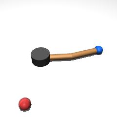
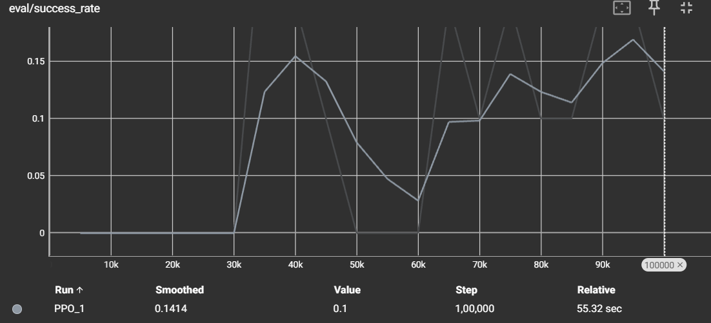
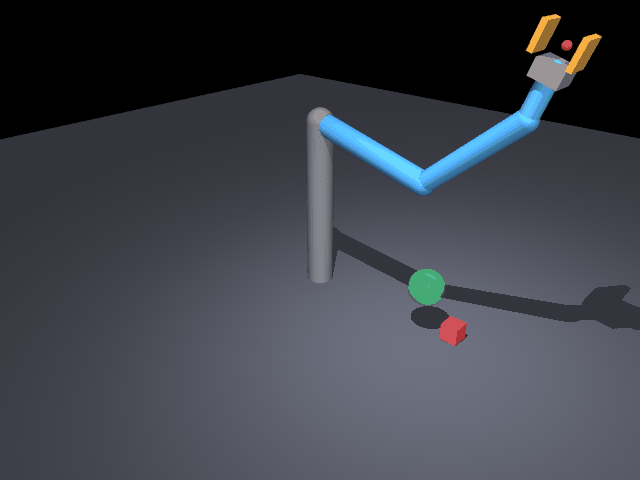
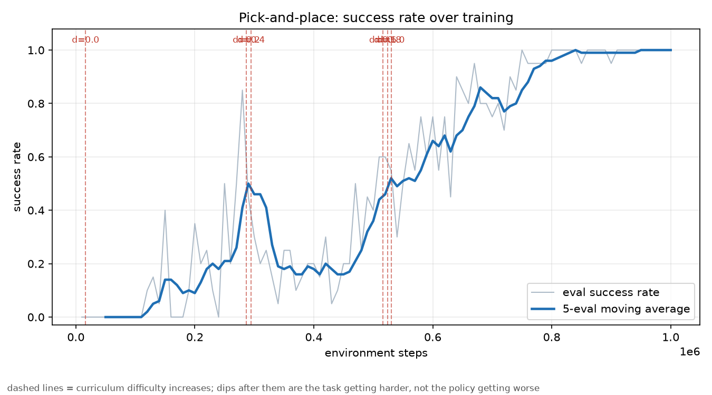

# robot-learning-manipulation

[](https://github.com/Froststar16/Robot-Learning-Manipulation/actions/workflows/tests.yml)

A little robot arm learns to point at things. Then it learns to pick them up.
Both in a physics engine, both from scratch, and both taking considerably
longer than I expected — mostly for reasons that had nothing to do with the
learning algorithm.

This is a portfolio project that turned into a running lesson in
**"don't trust the algorithm before you trust the environment."** Two separate
times, a flat training curve turned out to be a simulation bug rather than an
RL bug. Both stories are below, because they're the most useful thing in here.

---

## The 30-second version, for people who don't do robotics

A robot arm is just a few motors bolted together. Telling it "put the red block
over there" sounds simple, but the arm has no idea what a block is, where its
own hand is, or which way to turn a motor. Somebody has to teach it.

The old way: a human works out the maths for every motion, by hand, for every
task. Works beautifully until the block moves two centimetres.

The new way — **robot learning** — is to let the arm figure it out by trying.
It flails around, occasionally does something slightly less useless than usual,
gets told "warmer," and slowly stops flailing. Do that a few hundred thousand
times in a simulator (where crashing the robot costs nothing) and you get a
policy: a small neural network that looks at where things are and decides what
the motors should do next.

This repo is that whole loop, built by hand:

1. **Build a robot** — write out the arm's geometry, mass and joints as a
   physics model.
2. **Build a task** — spawn a target somewhere random, define what "success"
   and "warmer" mean.
3. **Let it learn** — an RL algorithm does the flailing and the improving.
4. **Check it isn't lying to you** — tests, hand-derived maths, scripted
   controllers that prove the task is possible in the first place.

Step 4 is the one people skip, and it's where both of my bugs lived.

---

## What's actually in here

### Task 1: Reach — *touch the target*

A 2-link arm has to move its tip to a randomly placed dot. The training
equivalent of a scale exercise: small enough that when something breaks, you
can actually find out why.

PPO and SAC (via Stable-Baselines3) take it from 0% to ~25–40% success in 200k
timesteps on a CPU. Not state-of-the-art, and it doesn't need to be — the point
is a clean, correct, tested pipeline.

### Task 2: Pick-and-place — *actually grab the thing*

A 3-DOF arm with a two-fingered gripper has to pick a box up off the table and
carry it to a target position. This is a genuinely different problem, not just
"reach with extra steps":

|                   | Reach                      | Pick-and-place                                    |
| ----------------- | -------------------------- | ------------------------------------------------- |
| Physics           | Smooth, nothing touches    | Discontinuous — contact forces every timestep      |
| Reward landscape  | One smooth hill to climb   | Two stages with a wall between them                |
| The catch         | —                          | You must **grasp** before anything else counts     |
| Ways to fail      | Be slow                    | Drop it, knock it away, squeeze it out sideways    |

That middle row is the whole problem. The grasp is a **bottleneck**: virtually
no path to success avoids it, and an arm flailing randomly almost never finds
it by accident. Most of the design in `environments/pick_place_env.py` exists
to deal with that one fact — a two-stage reward, a curriculum that starts easy,
and an off-policy algorithm that can replay each rare successful grasp many
times instead of seeing it once and forgetting.

### And the supporting cast

- **Domain randomization** — every episode, the arm's damping, mass, gearing
  and inertia get jittered. A policy that only works in one exact simulated
  world isn't much of a robot learning story.
- **24 passing tests**, including hand-derived inverse kinematics checked
  against MuJoCo's own forward kinematics, and a scripted controller that
  solves pick-and-place 100% of the time. That last one is load-bearing: it
  proves the task is *possible* before I'm allowed to blame the RL for
  anything.
- **Two debugging writeups** (`docs/topics_covered.md`,
  `docs/pick_place_notes.md`). Read these ones.

Everything is built directly on the **MuJoCo Python bindings** — no
`dm_control`, no `robosuite`. More work up front, but nothing in the
physics-to-RL pipeline is a black box I inherited from someone else's defaults.

---

## Results

**A trained policy reaching the target:**



*PPO, 200k timesteps, ~25–40% success at convergence on this budget. The blue
end-effector tracks over to the red target and the episode terminates on
contact.*

**Training curve:**



Success rate climbs from 0% as PPO learns the task, with the usual on-policy
noise between eval checkpoints rather than a smooth line — expected at this
budget on a CPU-only run.

**Pick-and-place — a trained policy picking the box up and delivering it:**





*PPO, 8 parallel envs, ~870k timesteps on a CPU, trained from a cold start.
100% success at every curriculum level, 40 evaluation episodes each. Verified
by stepping through the rollout frame by frame, not just trusting the
number — the box stays in the closed gripper from grasp to delivery, with
no airborne moment, which is exactly the check that caught it *not* doing
that two training attempts earlier (see Bug 3 below).*

| difficulty | grasp | lift | success | mean return | final dist (m) |
|---|---|---|---|---|---|
| 0.00 | 100% | 100% | 100% | 27.74 | 0.012 |
| 0.25 | 100% | 100% | 100% | 27.45 | 0.016 |
| 0.50 | 100% | 100% | 100% | 27.43 | 0.020 |
| 0.75 | 100% | 100% | 100% | 27.66 | 0.020 |
| 1.00 | 100% | 100% | 100% | 27.94 | 0.021 |

---

## The bugs worth reading about

### Bug 1: the arm was glued to the floor

Trained PPO for 60k steps. Success rate: 0%, flat as a table.

Before touching a single hyperparameter, I checked whether the task was even
solvable — derived the 2-link inverse kinematics by hand, confirmed every
sampled target was reachable, then drove the joints there with a basic
proportional controller through the actual actuators.

**That failed too.** Which was excellent news, because it meant the bug was in
the physics, not the learning. The arm links were sitting at exactly ground
level, so MuJoCo's contact solver was generating friction that fought nearly
every bit of motion. The same torque that produced ~0.03 rad/s of joint
velocity before the fix produced a physically sensible ~10 rad/s after turning
off arm–ground collisions. One `contype="0" conaffinity="0"` later, PPO started
learning normally.

**Moral:** if the learning curve is flat, check whether the environment is
solvable before you touch the algorithm. A scripted controller is a lot cheaper
than a hyperparameter sweep.

### Bug 2: the fix from Bug 1 nearly broke Task 2

The obvious move for pick-and-place was to copy the fix that worked: turn off
contact. Except **grasping *is* contact** — turn it off and the gripper's
fingers pass through the box like a ghost.

So instead of a global switch, the model uses MuJoCo's contact bitmasks to
allow exactly two collision pairs — box↔floor and box↔fingertips — and nothing
else. The arm can still sweep through the table without the old friction
problem, but the gripper can still pick things up. There's a test that runs 120
random-action steps and asserts no contact ever involves an arm link, so Bug 1
can't quietly come back.

**Moral:** a fix that works is not the same as a fix you understand. I got away
with the blunt version once; the second task made me learn what the setting
actually did.

### Bug 3: my agent learned to throw the box

This is the one I'd want to talk about in an interview.

Pick-and-place trained beautifully. 96% success. I ran my own evaluation
script, which reported **97% grasp rate and 100% lift rate**. Every number said
the policy had learned to pick things up.

Then I watched the GIF.

The arm wasn't picking anything up. It was **swatting the box** so that it flew
on a ballistic arc, and the instant that arc passed within 5 cm of the goal the
episode terminated with the success bonus. Episodes were ending in ~32 control
steps; the hand-written controller needs about 120. The box is airborne, well
above the arm, in half the frames.

The bug was my success condition:

```python
success = np.linalg.norm(box_pos - goal) < 0.05   # position only, one instant
terminated = success
```

Nothing in there required the box to be *stationary*, *held*, or *still there a
moment later*. A thrown box satisfies it exactly as well as a placed one — and
throwing is far easier to stumble into than grasping, so that is what
reinforcement learning found. This is **specification gaming**: the policy
maximised precisely what I asked for, and what I asked for was not what I
meant.

The part that stings is that my own diagnostics confirmed the hack instead of
catching it. `is_grasped()` fired on a single frame of pad contact, which a
swat produces. `peak_box_height` counted any height at all, which a launched
box trivially clears. I built the instruments and then trusted them without
ever watching a rollout.

**The fix.** Success is now *settled at the goal*: the box must have been
genuinely grasped, be within 5 cm, and be moving under 0.30 m/s — held for five
consecutive steps. A thrown object cannot satisfy that; a held one does so
trivially. Re-scoring the old policy under the corrected spec gives **0%**,
which confirms the diagnosis rather than merely asserting it.

Two further problems surfaced while retraining, both ordinary once you've seen
them and baffling if you haven't:

- **The curriculum stopped advancing.** It was gated on the *stochastic
  training* success rate, which sat at 0% while the *deterministic eval* policy
  was already at 50% — holding still for several steps is nearly impossible
  under exploration noise. A curriculum gated on the wrong signal silently
  spends the whole budget on the easiest level. Now gated on eval.
- **The terminal bonus was unreachable.** With a ten-step hold requirement the
  policy reached 19.8 mean return (the scripted controller gets 21.4) at **0%
  success** — carrying the box to the goal perfectly and then hovering there
  forever, because it never once experienced the +10 and so never learned that
  settling was a thing worth doing. Fixed by shortening the hold and adding a
  small per-step bonus while settled, turning a cliff into a gradient.

**Moral:** watch a rollout before you trust a number. Aggregate metrics measure
what you told them to measure, and if your success condition is wrong your
metrics will confidently agree with it.

### Bug 4: the fix that fixed Bug 3 turned out not to be learnable

Fixing Bug 3 was necessary but not sufficient. Retrained from scratch under
the corrected success spec and the policy converged to **0% success, every
seed, every difficulty** — with mean return pinned at 6.78 regardless of how
easy the task was made. That flat number, identical across every difficulty
level, was the tell: 6.78 is almost exactly the stage-1 shaping reward for
driving straight from the home pose onto the box and stopping. `peak height`
in the logs never left 0.022 m — box resting height. The arm was parking on
the box and never attempting to close its fingers, and no amount of extra
training time moved it, because it wasn't stuck — it had already converged.

Two independent causes, both found by testing rather than guessing:

**No reward gradient across the bottleneck.** Parking the gripper on the box
collects the entire stage-1 shaping return at zero risk. Every action needed
to actually grasp, lift and carry pays nothing until the whole sequence is
completed, so from the near side of the bottleneck the far side is invisible
to the policy gradient. The fix is a **reverse curriculum** (Florensa et al.,
2017): a fraction of *training* episodes now start with the box already held,
annealed to zero as the difficulty curriculum advances past 0.6. Learning the
second half of the task first gives the first half something to be worth.
The evaluation environment never uses this — it always starts from the real
initial state, so the reported numbers are the real task.

**The gripper action was absolute, so a stable grasp was ~0.1% likely.**
`GRASP_HOLD_STEPS` requires several *consecutive* control steps of closed
contact. With an absolute gripper command, holding a grasp meant sampling
"closed" from a noisy Gaussian policy several times in a row — measured at
well under 1%. I found this by starting *every* episode with the box already
in the gripper and training on that alone: the policy still logged zero
stable grasps. It was opening its fingers immediately, every episode, because
nothing punished the single-frame flicker of contact that instant. Switched
the gripper to residual/delta control, matching how the arm already worked —
the commanded width now persists between steps instead of needing to be
re-sampled correctly every 20 ms. That was the fix that actually mattered;
the reverse curriculum sped learning up, but the delta gripper is what made
holding a grasp something a Gaussian policy could stumble into at all.

There was a third contributor worth a sentence: the finger servo's gain was
too weak to physically counteract the box's weight even when closed correctly
(measured directly — 14 of 15 held-box test episodes dropped it within a
second). Raised alongside the other two fixes.

**Moral:** a flat, identical return across every difficulty level is a
different signature from noise or slow progress — it usually means the policy
found a local optimum that doesn't scale with task difficulty because it
never engages with the part of the task the difficulty parameter controls.
And when a reward is right but still unlearnable, check whether the action
space lets the policy express what the reward wants held, not just reached.

### Bug 5 (bonus): my own controller fought itself

The scripted controller for pick-and-place oscillated forever and never reached
its waypoint. Cause: it was feeding back the arm's *measured* joint angles, but
the environment already integrates actions into a position target — so the
controller was closing a loop around an integrator and winding the target far
past where it wanted to go. Classic integrator windup, self-inflicted.

Worth knowing because a *learned* policy in the same action space can do
exactly the same thing if the per-step action limit is set too large.

---

## Behaviour cloning: a wrong prediction, and a better result

Phase 5 opens with the cheapest possible imitation-learning baseline: fit a
small network directly to the scripted controller's `(observation, action)`
pairs, no reward function involved at all, and see how far pure supervised
cloning gets before reaching for sparse-reward RL + Hindsight Experience
Replay.

**The demonstrations.** `scripts/scripted_pick_place.py --save-demos`, run at
`difficulty=1.0` — the widest sampling range, which nests the narrower ranges
used at lower difficulties — for 300 episodes: 100% scripted success, 28,783
`(observation, action)` transitions saved. Only successful episodes are ever
written to the demo file, so this is clean expert data with no failed
rollouts mixed in.

**The policy.** A `[64, 64]` MLP with Tanh activations — matching Stable-
Baselines3's default PPO architecture — trained with plain MSE regression
against the demo actions, early-stopped on a held-out split around epoch 140
(val MSE 0.017).

**The prediction, stated before running the sweep:** BC should do well close
to the training distribution and degrade as task difficulty rises, because
the scripted controller is deterministic and only ever demonstrates one thin
manifold of trajectories through state space — the moment a cloned policy
drifts even slightly off that manifold under its own closed-loop rollout,
there's no data telling it how to recover. Textbook compounding error.

**What actually happened**, aggregated over 5 seeds × 40 episodes per
difficulty (200 rollouts per row, re-run after an initial 30-episode pass
gave two different, contradictory pictures — not enough signal to trust):

| difficulty | grasp | lift | success | mean return |
|---|---|---|---|---|
| 0.00 | 75% ± 9% | 75% ± 9% | **31%** ± 7% | 8.68 |
| 0.50 | 78% ± 6% | 78% ± 6% | **38%** ± 7% | 11.15 |
| 1.00 | 76% ± 5% | 76% ± 6% | **48%** ± 10% | 13.15 |

Success rate *rises* with difficulty. The prediction was backwards.

**Why — and this is the actual finding, not just a contradicted hypothesis.**
Grasp and lift are flat and statistically identical at every difficulty:
once BC establishes a stable grasp it reliably continues lifting the box,
so that part of the task isn't where it struggles. The entire gap between
"lifted" (~76%) and "settled at goal" (31–48%) opens up downstream, in
placement — and it's worst exactly where difficulty is *lowest*, because at
`difficulty=0.0` the goal sits within 2 cm of the box's starting position: a
narrow, tightly-clustered target that's a rare corner of the wide
(`difficulty=1.0`) distribution the demos were actually drawn from. The
policy has simply seen far less of the fine, small-motion placement behaviour
that low difficulty demands. Compounding error is still the right frame for
BC's ceiling — it just compounds against **data density**, not task
difficulty, and here those two things point in opposite directions.

One more number worth sitting with: the held-out regression loss (0.017 MSE)
is low and would look like a healthy fit on a slide. It has almost no
relationship to the 31–48% closed-loop success rate above it. Low open-loop
prediction error next to mediocre closed-loop task performance is the
textbook BC failure mode, and it's a better demonstration of *why* that
failure mode exists than a confirmed prediction would have been.

**Against the PPO baseline** (100% success at every difficulty, mean return
27.4–27.9): BC tops out at under half of PPO's return and well under half its
success rate across the whole sweep. That comparison, more than the absolute
BC numbers, is the actual point of running this baseline — it's the bar
sparse-reward RL + HER needs to clear to justify the extra machinery.

---

## Quickstart

```bash
git clone https://github.com/Froststar16/Robot-Learning-Manipulation.git
cd Robot-Learning-Manipulation
python -m venv venv && source venv/bin/activate    # Windows: .\venv\Scripts\Activate.ps1
pip install -r requirements.txt

pytest tests/ -v                                   # 24 tests, a couple of seconds
```

The same 20 tests, plus a scripted-controller sanity check, run on every push
via GitHub Actions — that's what the badge at the top is.

**Reach:**

```bash
python training/train_ppo.py --timesteps 100000 --run-name ppo_reach_v1
python evaluation/evaluate.py --model-path logs/ppo_reach_v1/best_model.zip --episodes 50
```

**Pick-and-place:**

```bash
# Sanity check first: can a hand-written controller solve it? (should print 100%)
python scripts/scripted_pick_place.py --episodes 20 --difficulty 1.0

# Train it. PPO with 8 parallel envs; converges in under 1M steps from a
# cold start, roughly 25-35 min on a CPU.
python training/train_pick_place.py --algo ppo --n-envs 8 --timesteps 1000000 --run-name ppo_pp_v1

# Interrupted? Same command plus --resume. Picks up from the last checkpoint
# with the curriculum level, the reverse-curriculum probability, and
# evaluation history all intact.
python training/train_pick_place.py --algo ppo --n-envs 8 --timesteps 1000000 --run-name ppo_pp_v1 --resume

tensorboard --logdir logs/
```

Then measure it:

```bash
python evaluation/evaluate_pick_place.py --model-path logs/ppo_pp_v1/best_model.zip --sweep
python evaluation/plot_pick_place.py --run-dir logs/ppo_pp_v1 --out results/pick_place_curve.png
python evaluation/record_pick_place_gif.py --model-path logs/ppo_pp_v1/best_model.zip
```

`evaluate_pick_place.py` reports **grasp, lift and success separately**, because
"45% success" is not a diagnosis. The gaps between the three localise the fault:
low grasp is an exploration problem, high-grasp-low-lift is a contact or friction
problem, high-lift-low-success is a stage-2 reward problem. It prints which one
you have.

Watch `curriculum/difficulty` and `curriculum/grasp_init_prob` in tensorboard.
Difficulty should start stepping up somewhere around 300-400k steps as
`grasp_init_prob` (the fraction of training episodes that start with the box
already held — see Bug 4 below) anneals toward zero. If `eval/mean_reward` is
pinned at a single flat value regardless of difficulty, that specific
signature means the policy has converged to parking on the box without
grasping — check `evaluate_pick_place.py --sweep` for a flat return across
every difficulty row before assuming it's still training.

**Behaviour cloning (Phase 5, part one):**

```bash
# Generate demonstrations from the scripted controller. Only successful
# episodes get written, so this is clean expert data.
python scripts/scripted_pick_place.py --episodes 300 --difficulty 1.0 --save-demos data/demos.npz

# Train, then sweep-evaluate by rollout (not held-out regression loss --
# closed-loop success is what actually matters, see writeup above).
python training/train_bc.py --demos data/demos.npz --epochs 150 --checkpoint out/bc_policy.pt

# Re-evaluate an existing checkpoint without retraining:
python training/train_bc.py --sweep-only --checkpoint out/bc_policy.pt --eval-episodes 40
```

**Making GIFs:**

```bash
python evaluation/record_gif.py --model-path logs/ppo_reach_v1/best_model.zip --out results/demo_rollout.gif
python scripts/scripted_pick_place.py --episodes 1 --gif results/scripted_pick.gif --camera angled
```

Needs offscreen rendering — fine on most desktops. On headless Linux:

```bash
sudo apt-get install libosmesa6 libgl1-mesa-dev libglfw3
MUJOCO_GL=osmesa python evaluation/record_gif.py --out results/demo_rollout.gif
```

---

## A few design decisions, and why

**PPO over SAC, decided by measurement rather than theory.** I originally
defaulted to SAC on a sample-efficiency argument: pick-and-place has a narrow
success funnel, so replaying each rare grasp many times should beat throwing
every batch away after one gradient step. The argument is correct and it turned
out not to matter. Measured throughput on this environment: **SAC ~60 fps, PPO
with 8 parallel envs ~780 fps** — one gradient step per environment step
dominates everything else on a CPU. There is no sample budget here, there is a
wall-clock budget, and SAC would need to be 13x more sample-efficient to break
even. It isn't. Both remain available via `--algo`.

**Position control with gravity compensation, not raw torques.** Under torque
control the policy has to learn to hold the arm up against gravity before it
can learn anything about the task, which eats most of a small sample budget.
Real manipulators expose a joint position interface with a servo underneath for
exactly this reason. Gravity compensation drops the steady-state joint error
from ~0.023 rad to roughly zero — which matters, because 0.023 rad at the end
of a 0.75 m arm is 1.7 cm of error, and the box is only 4.4 cm wide.

**Potential-based reward shaping.** The dense reward comes from *differences*
of negative distance, not raw negative distance. That specific form is provably
policy-invariant (Ng et al., 1999). "This shaping doesn't change the optimal
policy" is a much stronger thing to be able to say than "I tuned it until it
worked."

**A staged reward, not a summed one.** Reward approach-the-box and
move-box-to-goal at the same time and you get a policy that hovers next to the
box nudging it along the floor — collecting both terms without ever committing
to a grasp. Gating stage 2 behind an actual grasp closes that loophole.

**Grasp detection read from the contact solver**, not inferred from finger
positions. "Fingers closed and box nearby" reports a successful grasp when the
box is simply sitting on the table between two closed fingers.

**A tiny task before a hard one.** Reach exists so that correctness is
*checkable* — analytic IK, scripted controllers — before adding contact
dynamics, where bugs get much harder to find. Bug 2 is what that buys you.

---

## Repo structure

```
environments/
  reach_env.py              # Task 1 -- 2-link arm, no contact
  pick_place_env.py         # Task 2 -- 3-DOF arm + gripper, contact-rich
  assets/reacher_arm.xml
  assets/pick_place_arm.xml
training/
  train_ppo.py
  train_sac.py
  train_pick_place.py       # SAC/PPO + automatic curriculum callback
  train_bc.py               # behaviour cloning baseline (Phase 5, part one)
scripts/
  scripted_pick_place.py    # IK waypoint controller; also generates BC demos
evaluation/
  evaluate.py
  record_gif.py
  evaluate_pick_place.py    # grasp / lift / success breakdown, not one number
  plot_pick_place.py        # success curve annotated with curriculum steps
  record_pick_place_gif.py
domain_randomization/
  randomize.py
data/
  demos.npz                 # scripted-controller demonstrations (regenerate via Quickstart; consider .gitignore)
out/
  bc_policy.pt              # trained BC checkpoint (regenerate via Quickstart; consider .gitignore)
tests/
  test_env.py               # 7 tests -- reach
  test_pick_place_env.py    # 17 tests -- pick-and-place, incl. sparse reward-mode parity
docs/
  topics_covered.md         # concept map + Bug 1
  pick_place_notes.md       # the design rationale + Bugs 2 and 3
results/
```

---

## Roadmap

| # | Phase | Status |
|---|---|---|
| 1 | Foundations & environment setup | done |
| 2 | RL baseline: reach task | done |
| 3 | Manipulation: pick-and-place | done |
| 4 | Robustness: domain randomization | done (reach) |
| 5 | Imitation learning comparison | BC baseline done, HER next |
| 6 | Evaluation, visualization & docs | done |

**Phase 5, part one (behaviour cloning) is done** — see the writeup above.
It predicted the wrong failure mode, and that turned out to be more useful
than a confirmed prediction: BC's ceiling tracks demonstration data density,
not task difficulty. **Part two** is a sparse-reward + Hindsight Experience
Replay variant (`reward_type="sparse"` is already wired up and covered by
its own parity tests against the dense reward) to test whether goal
relabelling can recover what hand-designed reward staging bought Task 2 for
free. The open question there: the current success criterion depends on
grasp state and box speed, not just goal position, and HER's reward-from-
goal-pair convention doesn't naturally express that — so part of the work
is deciding what the goal vector should even be before any training runs.

---

## Where this sits relative to real manipulation research

Being straight about the simplifications, since they're all deliberate:

- **Planar, not 3D.** Keeps the IK analytic and the state space small enough to
  debug. The observation already carries the box's full quaternion, so going 3D
  is a model change and a bigger network, not a redesign.
- **State observations, not pixels.** The env hands the policy the box's pose
  directly. Real systems get camera images. MuJoCo's offscreen renderer is
  already wired up, so this is the natural next extension.
- **Top-down parallel-jaw grasps only.** No grasp pose selection, no dexterity.

And what is *not* simplified: the contact dynamics are real, the grasp is real
friction rather than a weld constraint, and the box can genuinely be dropped. A
common shortcut in tutorial pick-and-place environments is to glue the object
to the gripper with an equality constraint once the fingers get close enough.
That isn't done here — which is exactly why the policy was able to throw the
box, and why catching that was worth the trouble.

---

## License

MIT — use it, fork it, break it, fix it.
